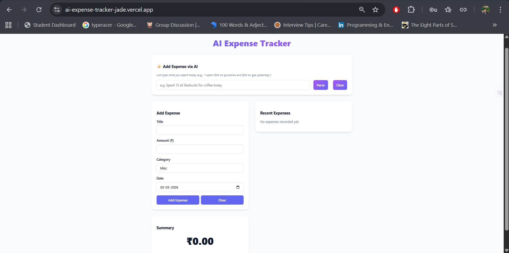
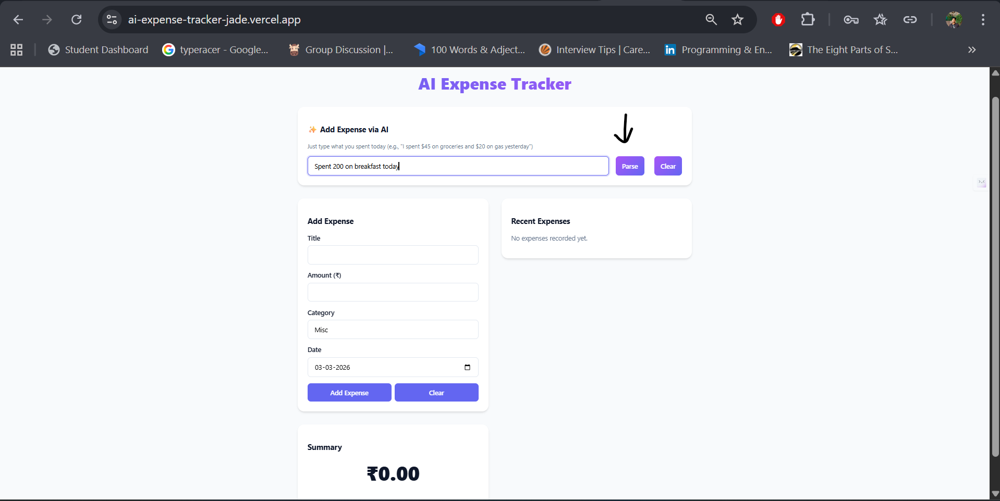
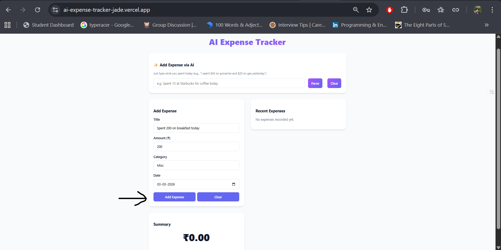
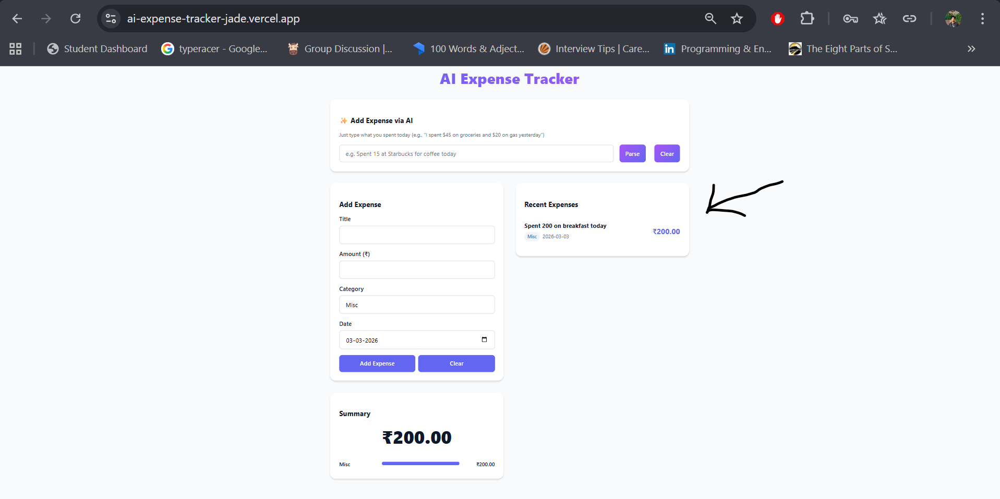
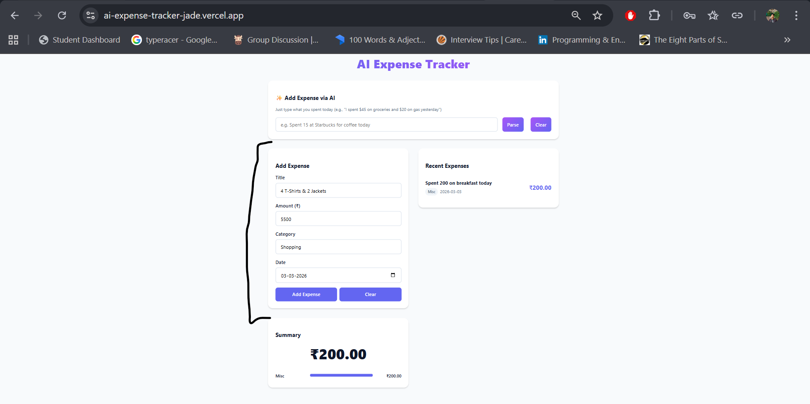
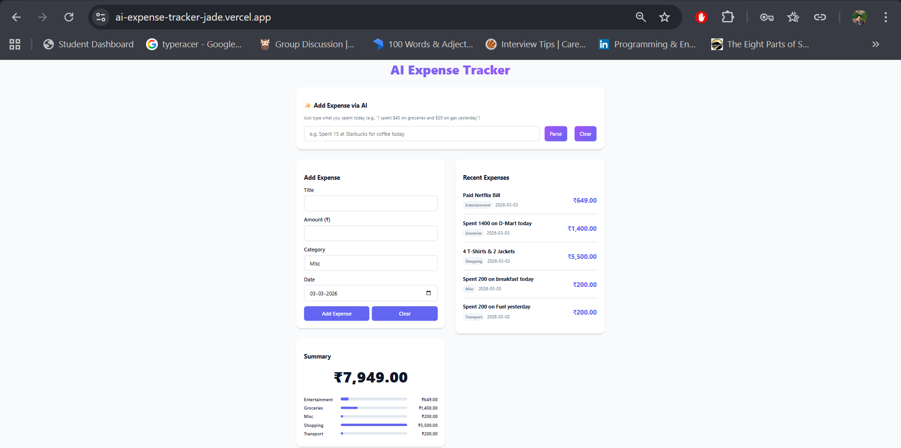

# AI Expense Tracker

An AI-powered expense tracking application that allows users to log expenses manually or by typing natural language (e.g., "Spent 300 on fuel yesterday"). The system intelligently extracts structured data and stores it in a PostgreSQL database with real-time summaries.

Production-ready full-stack app built with React, Flask, PostgreSQL, and OpenAI.

## Live Demo:
Frontend → https://ai-expense-tracker-jade.vercel.app
Backend API → [https://ai-expense-tracker-twt8.onrender.com/](https://ai-expense-tracker-twt8.onrender.com/expenses)

## Features
- RESTful API with Flask
- PostgreSQL database
- AI parsing using OpenAI (translates natural language to expense JSON)
- React frontend with modern UI

## Prerequisites
- Python 3.11+
- Node.js 18+
- PostgreSQL
- OpenAI API Key

## How it works
1. User types expense in natural language.
2. Backend sends text to OpenAI.
3. OpenAI returns structured JSON.
4. Backend validates and stores in PostgreSQL.
5. Frontend updates summary and expense list.

# Tech Stack
## Frontend
React
Vite
Axios
CSS (Custom UI)

## Backend
Flask
Flask-SQLAlchemy
PostgreSQL
OpenAI API
Gunicorn

## Deployment
Backend → Render
Frontend → Vercel
Database → Render PostgreSQL

# 📷 Screenshots
### Dashboard


### AI Parsing




### Expense



## Setup Backend

1. Navigate to `/backend`
2. Create and activate a virtual environment:
   ```bash
   python -m venv venv
   # Windows
   venv\Scripts\activate
   # macOS/Linux
   source venv/bin/activate
   ```
3. Install dependencies:
   ```bash
   pip install -r requirements.txt
   ```
4. Copy `.env.example` to `.env` and fill in your database credentials and `OPENAI_API_KEY`.
5. Create database tables:
   ```bash
   python -c "from app import create_app, db; app = create_app(); app.app_context().push(); db.create_all()"
   ```
6. Run the local development server:
   ```bash
   flask --app run run --debug
   # Or using gunicorn on linux/mac:
   gunicorn "run:app" -b 0.0.0.0:8000
   ```

## Setup Frontend

1. Navigate to `/frontend`
2. Install dependencies:
   ```bash
   npm install
   npm install axios
   ```
3. Copy `.env.example` to `.env` and set `VITE_API_URL=http://localhost:5000`
4. Run the development server:
   ```bash
   npm run dev
   ```

## Deployment

### Render (Backend)
- Add a new Web Service on Render, connect your repository.
- Root directory: `backend`
- Build command: `pip install -r requirements.txt`
- Start command: `gunicorn "run:app" -b 0.0.0.0:8000` (or `gunicorn "run:app" -b 0.0.0.0:$PORT`)
- Set environment variables `DATABASE_URL` (use your Render PostgreSQL internal URL) and `OPENAI_API_KEY`.

### Vercel (Frontend)
- Add a new Project, select this repository.
- Root directory: `frontend`
- Framework Preset: Vite
- Set environment variable `VITE_API_URL` to your Render backend URL.

## API Examples

**Create an expense manually:**
```bash
curl -X POST http://localhost:5000/expenses \
-H "Content-Type: application/json" \
-d '{"title": "Groceries", "amount": 450, "category": "Food"}'
```

**Parse an expense with AI:**
```bash
curl -X POST http://localhost:5000/ai-parse \
-H "Content-Type: application/json" \
-d '{"text": "Spent 450 on groceries today"}'
```
